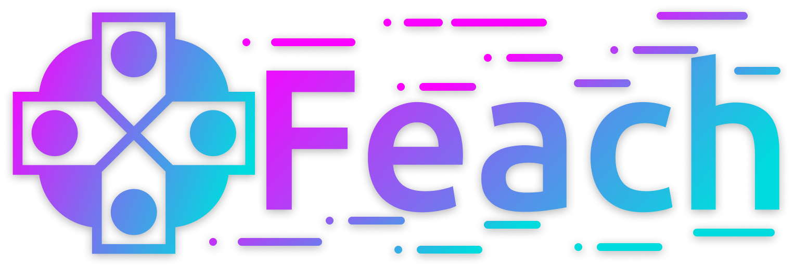

<h1 align="center">
  
</h1>

  <a href="#-tecnologias">Tecnologias</a>&nbsp;&nbsp;&nbsp;|&nbsp;&nbsp;&nbsp;
  <a href="#-projeto">Projeto</a>&nbsp;&nbsp;&nbsp;|&nbsp;&nbsp;&nbsp;
  <a href="#-como-executar">Como executar</a>&nbsp;&nbsp;&nbsp;|&nbsp;&nbsp;&nbsp;
  <a href="https://feach.vercel.app/">Pré-visualização</a>&nbsp;&nbsp;&nbsp;|&nbsp;&nbsp;&nbsp;
  <a href="#-licença">Licença</a>

## ✨ Tecnologias

Esse projeto foi desenvolvido com as seguintes tecnologias:

- [React](https://reactjs.org)
- [Next.js](https://nextjs.org/)
- [TypeScript](https://www.typescriptlang.org/)
- [Styled Components](https://styled-components.com/)

## 💻 Projeto

Feach Community está sendo projetado para tentar criar um lugar onde Gamers possam ficar infomado sobre tudo que acontece além de fazer novas amizades.

## 📑 To-Do

Algumas coisas que quero implementar ou alterar para dar um up no projeto.

- [x] Criar um README.

## 🚀 Como executar

- Clone o repositório
- Instale as dependências com `yarn`
- Inicie o servidor com `yarn dev`

Agora você pode acessar [`localhost:3000`](http://localhost:3000) do seu navegador.

## 📄 Licença

Esse projeto está sob a licença MIT. Veja o arquivo [LICENSE](LICENSE) para mais detalhes.

---

Feito com ♥ by Miguel Ângelo.